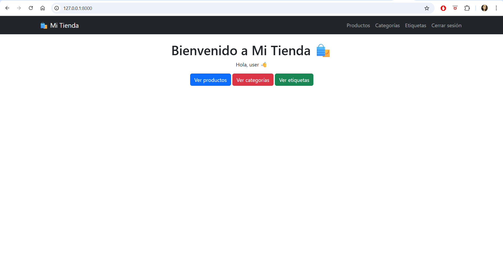
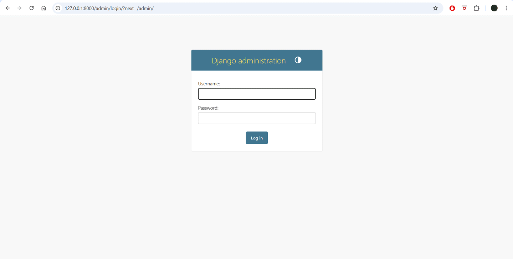
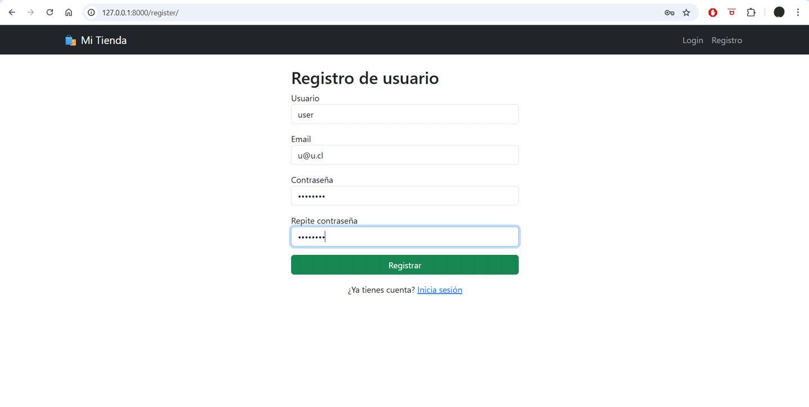
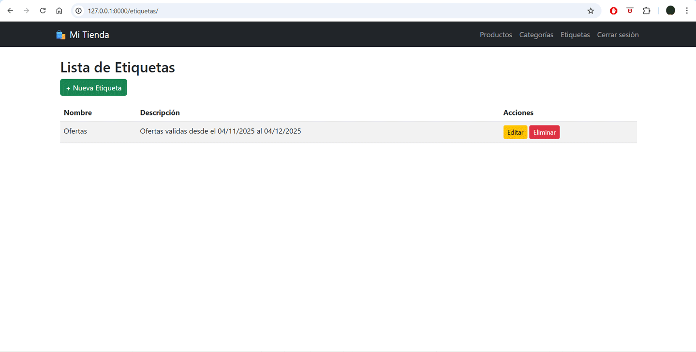
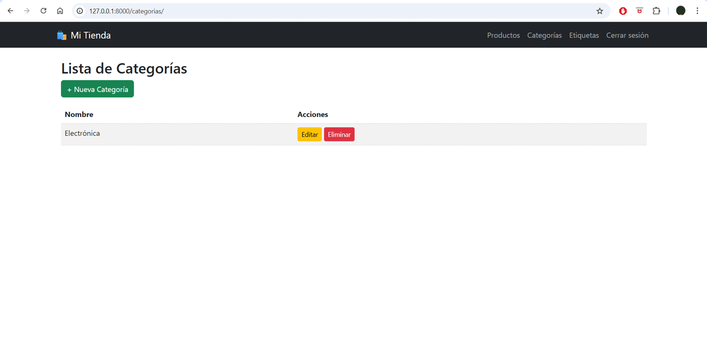

# Proyecto Django - Gestión de Productos

Este proyecto es una aplicación web desarrollada en **Django 5.2.7** que permite gestionar productos, categorías y etiquetas. Incluye autenticación de usuarios, CRUD completo y manejo de relaciones entre modelos.

---

## 📦 Funcionalidades

1. **Gestión de Productos**
   - Crear, editar, eliminar y listar productos.
   - Cada producto tiene detalles asociados (dimensión y peso) mediante un modelo `DetalleProducto`.
   - Las etiquetas se pueden asignar a múltiples productos.
   
2. **Gestión de Categorías**
   - Crear, editar, eliminar y listar categorías.
   - La eliminación de una categoría elimina automáticamente todos los productos asociados (relación cascade).

3. **Gestión de Etiquetas**
   - CRUD completo para etiquetas.
   - Relación muchos a muchos con productos.

4. **Autenticación**
   - Registro de usuarios.
   - Login y logout.
   - Todas las vistas de gestión requieren autenticación.

---

## 🖼 Capturas de pantalla

### Página principal


### Panel de administración Django


### Iniciar sesión y registro


### CRUD de productos


### CRUD de etiquetas


### CRUD de categorías con eliminación en cascada


---

## 🔧 Modelos principales

### Producto
- `nombre`: CharField(100)
- `descripcion`: TextField
- `precio`: DecimalField
- `categoria`: ForeignKey(Categoria)
- `etiquetas`: ManyToManyField(Etiqueta)

### DetalleProducto
- `producto`: OneToOneField(Producto)
- `dimension`: CharField
- `peso`: DecimalField

### Categoria
- `nombre`: CharField
- Eliminación en cascada de productos asociados.

### Etiqueta
- `nombre`: CharField
- Relación muchos a muchos con productos.

---

## 🚀 Instalación

1. Clonar el repositorio:

```bash
git clone https://github.com/JATeR912/M7_Evaluacion_de_modulo
cd proyecto-django
```

2. Crear entorno virtual e instalar dependencias:

```bash
python -m venv venv
source venv/bin/activate  # Linux/Mac
venv\Scripts\activate     # Windows
pip install -r requirements.txt
```

3. Migrar la base de datos:

```bash
python manage.py makemigrations
python manage.py migrate
```

4. Crear superusuario para acceder al admin:

```bash
python manage.py createsuperuser
```

5. Ejecutar el servidor:

```bash
python manage.py runserver
```

## ⚙ Uso
Acceder a la página principal: http://127.0.0.1:8000/

Iniciar sesión o registrarse.

Gestionar productos, categorías y etiquetas.

Eliminar una categoría elimina todos sus productos asociados automáticamente.

## 📄 Notas
Todos los campos obligatorios deben ser completados.

DetalleProducto.peso y DetalleProducto.dimension tienen valores por defecto si no se proporcionan.

Las vistas de edición crean automáticamente el detalle si no existe.

## 💻 Tecnologías usadas
Python 3.11+

Django 5.2.7

PostgreSQL

HTML, CSS, Bootstrap (opcional)

## Estructura del proyecto
 ```bash
.
│
├── manage.py
├── requirements.txt
├── README.md
├── assets/                 # Carpeta para imágenes y gifs usados en README
│   ├── index.jpg
│   ├── admin.gif
│   ├── login_register.gif
│   ├── crud_productos.gif
│   ├── crud_etiquetas.gif
│   └── crud_categorias.gif
│
├── empresa/            # Carpeta principal del proyecto 
│   ├── __init__.py
│   ├── settings.py
│   ├── urls.py
│   ├── asgi.py
│   └── wsgi.py
│
├── productos_app/          # Aplicación de productos
│   ├── migrations/
│   │   └── __init__.py
│   ├── templates/productos_app/
│   │   ├── crear.html
│   │   ├── editar.html
│   │   ├── eliminar.html
│   │   ├── detalle.html
│   │   └── lista.html
│   ├── admin.py
│   ├── apps.py
│   ├── forms.py
│   ├── models.py
│   ├── urls.py
│   └── views.py
│
├── categorias_app/         # Aplicación de categorías
│   ├── migrations/
│   │   └── __init__.py
│   ├── admin.py
│   ├── apps.py
│   ├── models.py
│   ├── urls.py
│   └── views.py
│
├── etiquetas_app/          # Aplicación de etiquetas
│   ├── migrations/
│   │   └── __init__.py
│   ├── admin.py
│   ├── apps.py
│   ├── models.py
│   ├── urls.py
│   └── views.py
│
└── templates/              # Templates globales
    ├── base.html
    ├── index.html
    ├── login.html
    └── register.html

```

## 📝 Licencia MIT


